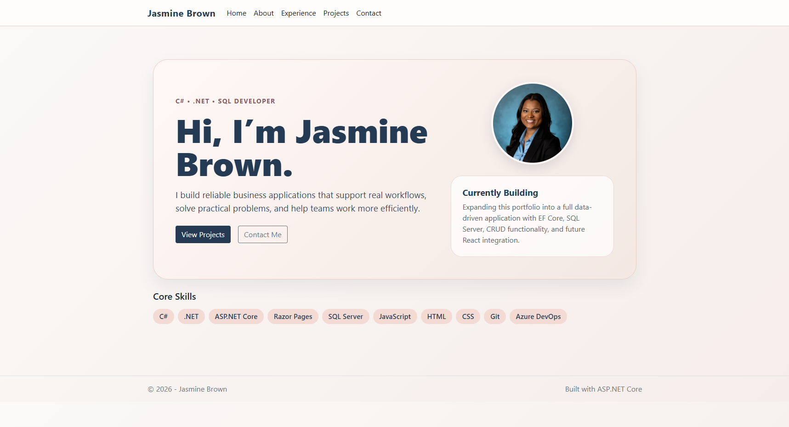
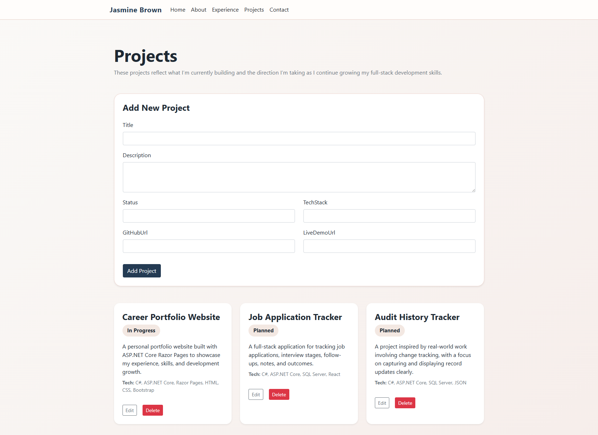
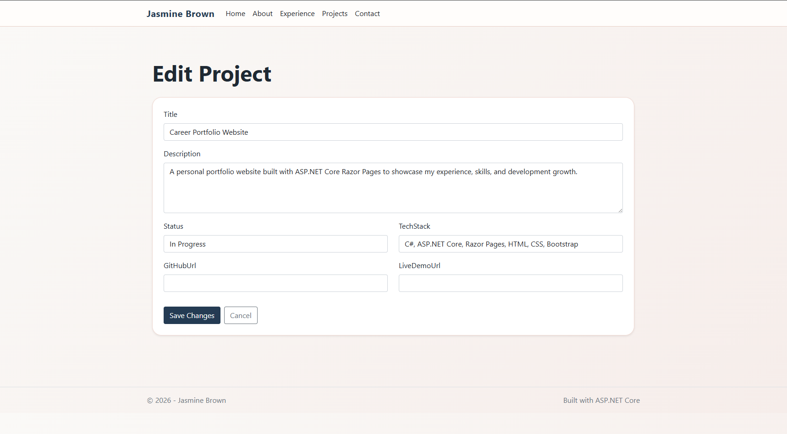

# 💼 Jasmine Brown | Software Developer Portfolio

A full-stack career portfolio application built with ASP.NET Core, Razor Pages, Entity Framework Core, and SQL Server.

This project showcases my experience building data-driven applications, implementing CRUD functionality, and designing clean, user-focused interfaces.

---

## 🚀 Tech Stack

* C#
* ASP.NET Core (Razor Pages)
* Entity Framework Core
* SQL Server (LocalDB)
* HTML / CSS / Bootstrap

---

## ✨ Features

* Dynamic Projects, Skills, and Experience sections
* Full CRUD functionality for Projects (Create, Edit, Delete)
* Data persistence using EF Core and SQL Server
* Clean, responsive UI with custom styling
* Personal branding with hero section and headshot

---

## 📸 Screenshots

### Home



### Projects



### Edit Project



---

## 🧱 Project Phases

### Phase 1: Static Portfolio

* Built core pages using Razor Pages
* Implemented layout and navigation

### Phase 2: Data-Driven Application

* Integrated SQL Server with EF Core
* Created models and database schema
* Implemented SeedData
* Converted pages to dynamic rendering

### Phase 3: CRUD Functionality

* Added Create, Edit, and Delete for Projects
* Implemented form validation
* Connected UI to database operations

### Phase 4: UI Polish & Personal Branding

* Improved layout, spacing, and responsiveness
* Designed a clean, professional UI
* Added personal branding and headshot

---

## 🧠 What I Learned

* Building full-stack applications with ASP.NET Core and EF Core
* Managing data flow between UI, backend, and database
* Implementing CRUD operations using Razor Page handlers
* Designing clean and user-friendly interfaces
* Structuring projects using phased development

---

## 🛠️ Running the Project

1. Clone the repository
2. Run migrations:

```
Add-Migration InitialCreate  
Update-Database
```

3. Run the application

The database will automatically seed with initial data.

---

## 📫 Contact

* LinkedIn: (add your link)
* GitHub: (your profile)

---

✨ This project reflects my growth as a developer and my focus on building practical, reliable software solutions.
